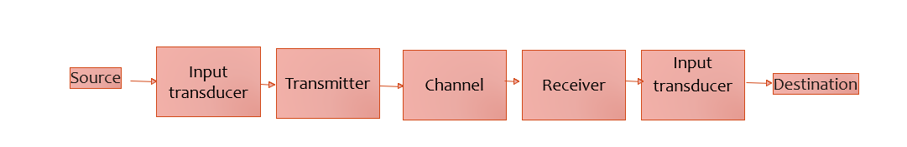
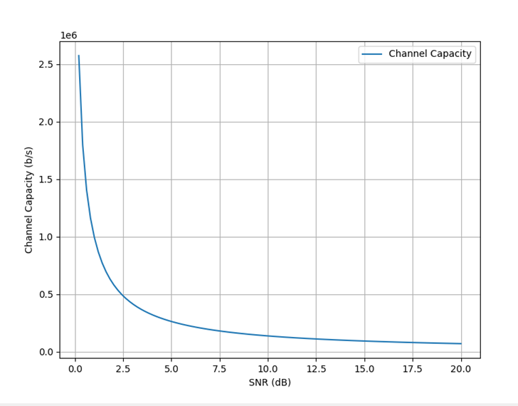

# Day 1
# Introduction to Telecom

## Communication basics

- Communication is a process of transfer of information from Sender to Receiver over a communication medium
- Communication medium
    - Verbal communication
    - Written communication
    - Electronics and Digital communication
    - Visual communication
    - Print media
    - Broadcast media
    - Gestures and body language

## Communication systems

A communication system conveys information from its source to a destination.

## Capacity of a channel

The most important question for a communication channel is the maximum rate at which it can transfer information. 
There is a theoretical maximum rate at which information passes error free over the channel, called the channel capacity C. 
The famous Hartley-Shannon Law states that the channel capacity C is given by: 

`C=B*log(1+(S/N))`

Where, 
 - B is the bandwidth, 
 - S/N is the signal-to-noise ratio.

## What is telecommunications?

Telecommunications is the transmission of information over a distance. It encompasses a wide range of technologies, from simple telephone networks to complex fiber optic networks. 

## What are the changes that telecommunications engineering tries to solve?

General challenges in telecommunications engineering include:

- Performance
- Reliability
- Affordability 

Some specific challenges are
- Increasing the capacity of telecommunications networks to handle more data traffic
- Reducing the latency of telecommunications networks to improve the responsiveness of applications
- Expanding the coverage of telecommunications networks to reach more people and places
- Making telecommunications networks more secure and resilient to attacks
- Reducing the cost of telecommunications services to make them more affordable for everyone

## What are the breakthroughs in telecommunications engineering?

| Year | Innovation/Discovery or Invention | Wikipedia article |
|---|---|---|
| 1832 | Samuel F. B. Morse invents the telegraph | [Telegraph](https://en.wikipedia.org/wiki/Telegraph) |
| 1876 | Alexander Graham Bell invents the telephone | [Telephone](https://en.wikipedia.org/wiki/Telephone) |
| 1887 | Heinrich Hertz discovers radio waves | [Radio wave](https://en.wikipedia.org/wiki/Radio_wave) |
| 1895 | Guglielmo Marconi invents the radio | [Radio](https://en.wikipedia.org/wiki/Radio) |
| 1906 | Lee De Forest invents the triode vacuum tube | [Triode](https://en.wikipedia.org/wiki/Triode) |
| 1920 | The first commercial radio broadcast is made in Pittsburgh, Pennsylvania | [Commercial radio broadcasting](https://en.wikipedia.org/wiki/Commercial_radio_broadcasting) |
| 1927 | Philo T. Farnsworth invents the television | [Television](https://en.wikipedia.org/wiki/Television) |
| 1947 | The transistor is invented at Bell Labs | [Transistor](https://en.wikipedia.org/wiki/Transistor) |
| 1956 | The integrated circuit is invented at Texas Instruments | [Integrated circuit](https://en.wikipedia.org/wiki/Integrated_circuit) |
| 1969 | The first ARPANET node is installed at UCLA | [ARPANET](https://en.wikipedia.org/wiki/ARPANET) |
| 1973 | The first mobile phone call is made on a Motorola DynaTAC | [Mobile phone](https://en.wikipedia.org/wiki/Mobile_phone) |
| 1974 | Vint Cerf and Bob Kahn develop the Transmission Control Protocol/Internet Protocol (TCP/IP) | [TCP/IP](https://en.wikipedia.org/wiki/TCP/IP) |
| 1985 | The first commercial cellular network is launched in the United States | [Cellular network](https://en.wikipedia.org/wiki/Cellular_network) |
| 1989 | Tim Berners-Lee invents the World Wide Web | [World Wide Web](https://en.wikipedia.org/wiki/World_Wide_Web) |
| 1993 | The first web browser, Mosaic, is released | [Web browser](https://en.wikipedia.org/wiki/Web_browser) |
| 1998 | The first commercial satellite internet service is launched | [Satellite internet](https://en.wikipedia.org/wiki/Satellite_internet) |
| 2001 | The first 3G cellular network is launched in Japan | [3G](https://en.wikipedia.org/wiki/3G) |
| 2009 | The first 4G cellular network is launched in Sweden | [4G](https://en.wikipedia.org/wiki/4G) |
| 2019 | The first 5G cellular network is launched in South Korea | [5G](https://en.wikipedia.org/wiki/5G) |

This is just a small sample of the many breakthroughs in telecommunications engineering over the years. Telecommunications engineering has revolutionized the way we communicate and access information, and it continues to evolve at a rapid pace.

 

## Generations of telecom

| Primary Motivation | Year | Technology | Details | Link to Documentation |
|---|---|---|---|---|
| To enable mobile communication | 1946 | 0G | Pre-cellular mobile radio telephone systems, such as Mobile Telephone System (MTS) and Advanced Mobile Telephone System (AMTS) | [Wikipedia article on 0G](https://en.wikipedia.org/wiki/0G) |
| To improve the capacity and reliability of mobile communication | 1979 | 1G | Analog cellular networks, such as Advanced Mobile Phone System (AMPS) and Nordic Mobile Telephone (NMT) | [Wikipedia article on 1G](https://en.wikipedia.org/wiki/1G) |
| To introduce digital technology to mobile communication, improving voice quality and data transmission rates | 1991 | 2G | Digital cellular networks, such as Global System for Mobile Communications (GSM) and Code Division Multiple Access (CDMA) | [Wikipedia article on 2G](https://en.wikipedia.org/wiki/2G) |
| To provide high-speed data transmission for mobile devices | 2001 | 3G | Third-generation cellular networks, such as Universal Mobile Telecommunications System (UMTS) and CDMA2000 | [Wikipedia article on 3G](https://en.wikipedia.org/wiki/3G) |
| To provide even higher-speed data transmission and lower latency for mobile devices, enabling new applications such as mobile video and mobile broadband | 2009 | 4G | Fourth-generation cellular networks, such as Long-Term Evolution (LTE) and WiMAX | [Wikipedia article on 4G](https://en.wikipedia.org/wiki/4G) |
| To provide extremely high data rates, low latency, and massive connectivity for mobile devices and the Internet of Things (IoT), enabling new applications such as self-driving cars, augmented reality, and virtual reality | 2019 | 5G | Fifth-generation cellular networks | [Wikipedia article on 5G](https://en.wikipedia.org/wiki/5G) |
| To further improve the performance and capabilities of 5G, enabling new applications such as 6G-enabled smart cities and factories | 2030 (planned) | 6G | Sixth-generation cellular networks | [Wikipedia article on 6G](https://en.wikipedia.org/wiki/6G) |

## Question

What are some standards that help in adoption of the technologies across world?